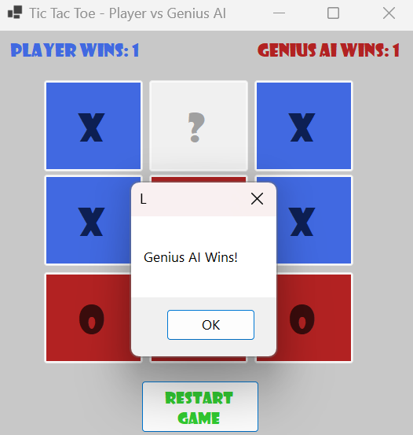

# Tic-Tac-Toe

This repository contains a simple Tic Tac Toe game created in C#, where you can play against a computer with a rule-based AI. The game is built using C# and Windows Forms.

## Features

1. Two Players: The game is played between a human player (X) and an AI (O).
2. Rule-Based AI: The AI makes strategic moves to either win the game or block the human player from winning.
3. Win Counter: Counts the wins of each player.
4. Game Restart: Easily restart the game at any point.

## Screenshot

## Prerequisites

1. Visual Studio 2022
2. .NET Desktop Development
3. Windows Forms App

## Running the Game

1. Start the application by running the project in Visual Studio.
2. The game window will open, centered on your screen.

## Running the Executable

If you prefer to run the game directly, an executable file is available in the bin folder:

1. Download the 'bin' folder.
2. Within the subfolder '...\bin\Debug\net8.0-windows\', find the Tic-Tac-Toe.exe file.
3. Double-click on Tic-Tac-Toe.exe to start the game. (Windows only)

## How to play

1. If you go first, click on any button to place your mark (X).
2. The AI will make its move (O) automatically.
3. Continue until there is a winner or the game is a draw.
4. The game will display a message indicating the result and will restart automatically.
